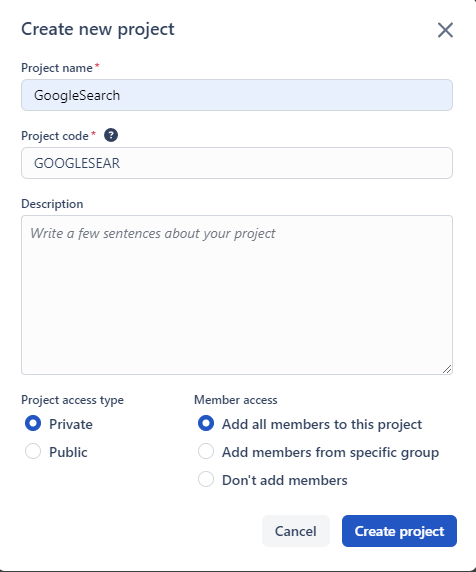
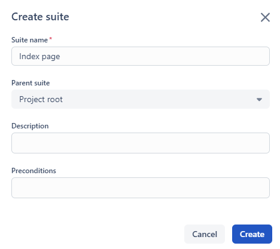
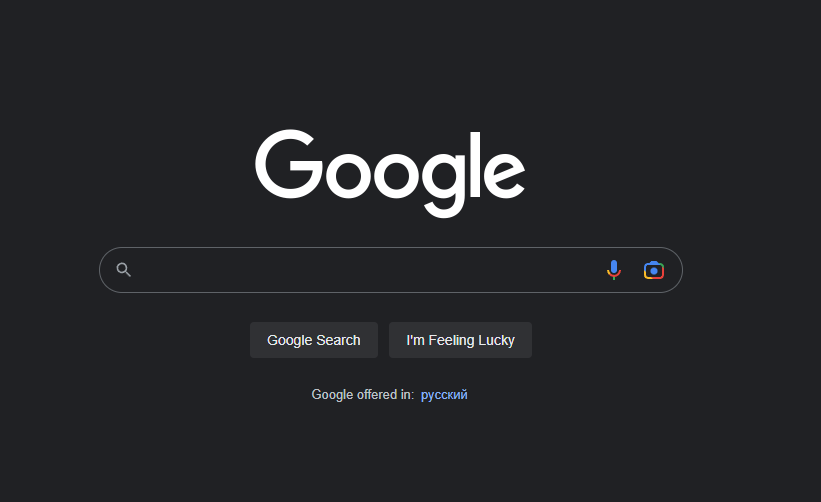
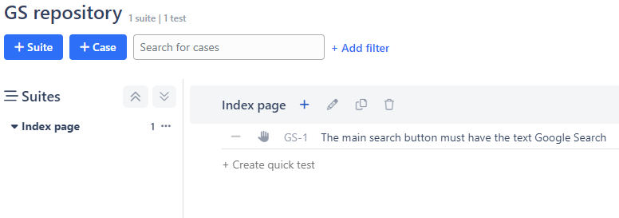

# pytest-playwright

---

## UI autotest using Pytest and Playwright

---

Tools used:

+ [Python 3.11.2](https://www.python.org/downloads/)
+ [requests 2.28.2](https://pypi.org/project/requests/)
+ [playwright 1.30.0](https://pypi.org/project/playwright/)
+ [pytest 7.2.1](https://pypi.org/project/pytest/)

---

## How to use this project

1. Install requirements

+ If you use Windows install requirements with the following command:
```pip install -r requirements.txt```

+ If you use Linux install requirements with the following command:
```pip3 install -r requirements.txt```

2. Registrate on Qase.io TMS (Test Management System)
+ [Modern TestOps platform](https://qase.io/)

3. Create new project GoogleSearch


4. Create new suite Index Page


5. Test suite Index Page is a representation of the main Google page


+ [Google](https://www.google.com/)

6. Lets check that main search button have the text Google Search
+ Create test case in the Index Page suite
